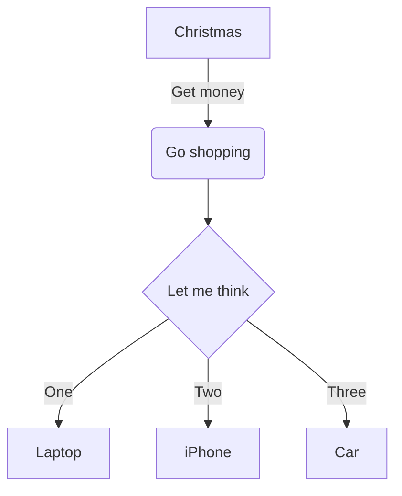

# Project Name - Author

## Project Description

Short crisp sentence of what this project sets out to do.

## Mockup

<!-- to have more control over image size & appearance, markdown supports html img tags also:
  
-->

## To Run
<!-- 
### On The Web 
1. Project in its current state runs live on any device via standard browser at https://
-->
### In Your Local Environment
<!-- Python Project Local Environment Template-->
1. git clone this repo to a local project folder
2. consult `./requirements.txt` for necessary libraries to install (easily install those at the command line in your project folder with `pip install -r requirements.txt`)
3. consult `./.env.example` for clues on environment variables you'll need to provide in your own `.env` file using your own credentials (if required)
4. I built this project in __Python 3.14.2__, but I think it should work in any 3.8x or newer, based on the standard libraries and code used.

## Product Roadmap (Deliverables)

### MVP (Must Do)

- [ ] tick list of MVP deliverables
- [x] utilize object oriented programming wherever possible (classes and methods in separate external files, use class inheritance, keep main.py very tight and readable for flow.)
- [x] employ great documentation in any and all *.py files, written so other developers and casuals can easily understand your code blocks and flow

### Stretch Goals (Should Do at some point)

- [ ] tick list of stretch deliverables
  
### Super-Stretch Goals (Could Do at some point)

- [ ] tick list of super stretch deliverables

### Out of Scope (Won't Do)

- list of things we recognize but don't plan on addressing with this project

## Design

### Flowchart (Program Logic Flow)

## Development Workflow

- [ ] 1. do this
- [ ] 2. do that
- [ ] 3. do 3
- [ ] 4. do 4
  - [ ] 4.1 subtask
  - [ ] 4.2 subtask
  - [ ] 4.3 subtask
- [ ] 5. END-TO-END TEST in as close to production environment as possible
- [ ] 6. PRODUCTION BETA to fraction of actual users
- [ ] 7. FULL DEPLOYMENT ramp to 100% production

## Reflection

| DATE | COMMENTS |
| ----------- | -------- |
| 01-jan-2026 | SUMMARY: do this one last (you'll always put the most recent date at the top of the stack) |
| 31-dec-2025 | brief comments on what you did and learned that day |

## References

- [README.md Best Practices](https://github.com/jehna/readme-best-practices) I follow (some, not a lot of) these best practices 😂
- [Markdown Guide - Basic Syntax](https://www.markdownguide.org/basic-syntax/)

<!-- MORE EXAMPLES OF MERMAID DIAGRAMS
### Block Architecture Diagram (System Main Components)
architecture-beta
### Sequence Diagram (User Interaction)
sequenceDiagram
### Entity Relationships (Data Design)
erDiagram

can also do Gantt, Customer Journey/Friction, Pie, X/Y, Quadrant, Mindmap, many others.
see Mermaid live editor & docs [here](https://mermaid.live) for all possibilities 
-->