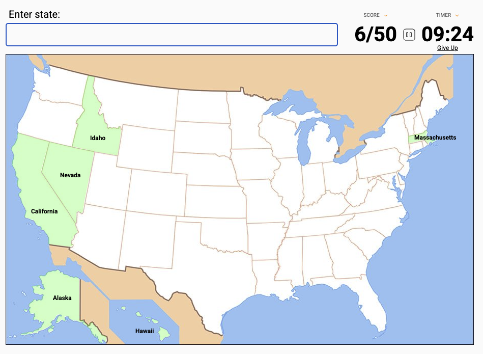

# 50 States Quiz Project - Rudi Lewis
Day 25 in the 100 days of Python! 
## Project Description
Build a quiz that asks the user to look at a map and enter all 50 state names, overlaying each state name onto the map as it is named.
- The state names and their x/y coordinates on the image are stored in `50_states.csv`
- The blank map is a gif image stored in `blank_states_img.gif`
- The quiz should prompt the user to enter another state
  - if the state is valid:
    - look up its x,y coordinates and plot the state name on the map
    - update the prompt title bar with the score "x/50 States Correct"
  - if it's not valid just error handle by clearing the prompt and letting the user try again 

## Deliverables
### MVP: 
- [x] build a working 50 states quiz as outlined in the description above and detailed in the development workflow below
- [x] use the external pandas module to handle the csv data for valid state names and their coordinates
- [x] utilize object oriented programming wherever possible (classes and methods in external files, class inheritance, keeping main.py very tight and readable for flow.)
- [x] great documentation in any and all *.py files, written so other developers can easily understand your code blocks and flow
### stretch goals: 
- [x] listen for "exit" at prompt to quit and record final score
- [x] add "states_to_learn.py" file that records missed states from the previous run
- [ ] add "high score" functionality (it only takes a couple tries to get all 50 so HS is kind of useless)
### super-stretch goals: 
- [ ] add a timer and "best score and best time" functionality (really becomes just a typing speed test after a couple tries. abandoning.)
- [ ] color overlay on map for each correct state (would probably require tracing of 50 different state lines, or finding it on internet)

## Mockup
The following "mockup" is actually from the real version of the quiz hosted on [sporcle.com](https://www.sporcle.com/games/g/states)

## To Run
  1. For now, clone to local deployment only. 
     - Requires:
       - Turtle Graphics package (usually included in your standard Python install).
       - Pandas data analysis toolkit available on pypi.org
  2. I built it in Python 3.14.2, but I think it should work in any 3.x based on the standard libraries and code used.

## Development Workflow
- [x] 1. Create the screen 
- [x] 2. Create the "turtle" object, shaped as the map image
- [x] 3. Create the user prompt
- [x] 4. detect "Enter" key and lookup user input for accuracy
- [x] 5. Plot state name to map
- [x] 6. Keep scoreboard in prompt title area
- [x] 7. DEPLOY and TEST (locally) 

## Reflection
| DATE        | NOTES                                                                                                                                                          |
| ----------- | -------------------------------------------------------------------------------------------------------------------------------------------------------------- |
| 14-jan-2026 | Gemini can definitely see into my README.md with this Gemini Code Assist update 2.67, their left pane follow up question nudges are aimed at my stretch goals. |

## References
  * [Sporcle Quiz Site](https://www.sporcle.com)
  * [Pandas package from PyPi](https://pypi.org/project/pandas/)
  * [Gemini Code Assist Release Notes](https://docs.cloud.google.com/gemini/docs/codeassist/release-notes)
