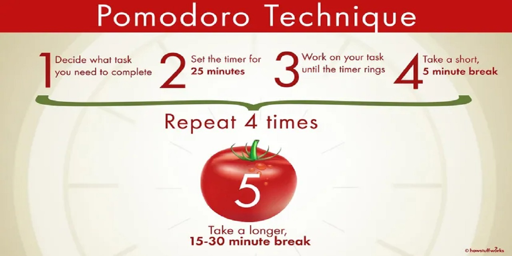

# Pomodoro Timer - Rudi Lewis
Day 28 Project in the 100 days of Python! 
## Project Description
Build a Pomodoro Timer GUI using TKinter.

## Deliverables
### MVP: 
- [x] build a working pomodoro timer based on the pomodoro_method.jpeg diagram above
- [x] use the tkinter module for all screen/window rendering
- [x] utilize object oriented programming wherever possible (classes and methods in external files, class inheritance, keeping main.py very tight and readable for flow.)
- [x] employ great documentation in any and all *.py files, written so other developers and casuals can easily understand your code blocks and flow
### stretch goals: 
- [ ] play with color themes using colorhunt.co (i've saved a palette to assets, can go from there)
- [ ] add sounds for timer end / break end (haven't studied those yet in the class)
### super-stretch goals: 
- [ ] keep stats in a pom_history.txt file (log pomodoro's per date to begin with, then per "project" (additional parameter/input field) if you're really feeling your oats)

## Mockup

## To Run
  1. For now, clone to local deployment only. 
     - Requires:
       - TKinter GUI package (usually included in your standard Python install).
       - (not yet until we get to super-stretch goal) Pandas data analysis toolkit available on pypi.org (for the csv stats download/update)
  2. I built it in Python 3.14.2, but I think it should work in any 3.x based on the standard libraries and code used.

## Development Workflow
- [x] 1. Create the screen (window)
- [x] 2. Backdrop it with the background image in ./assets/tomato.png
- [x] 3. Create the timer reset logic
- [x] 4. Create the timer mechanism logic
- [x] 5. Create the countdown mechanism logic
- [x] 6. Create the UI: text and buttons aligned in grid (more or less) with the mockup in ./docs/pomodoro_mockup.gif
- [x] 7. DEPLOY and TEST (locally) 

## Reflection
| DATE        | NOTES                                                                                                                                                                        |
| ----------- | ---------------------------------------------------------------------------------------------------------------------------------------------------------------------------- |
| 15-jan-2026 | not enough tomatoes (time) remaining to get to the stretch goals. I would like to loop back to it and possibly turn it into a web-accessible app. I love pomodoro technique! |
| 15-jan-2026 | big assist from Gemini Code Assist to help me get my timers working.                                                                                                         |

## References
  * [window.after() usage explanation from Gemini 3.0 Pro](window_after_explanation.md)
  * [Pomodoro Technique](https://www.pomodorotechnique.com)
  * [Colorhunt.co](https://colorhunt.co) (I love this site for color palette ideas)
