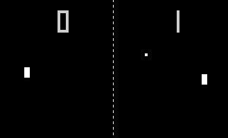

# PONG project
Day 22 in the 100 days of Python!
## Project Description
Recreate the classic PONG video game using Python, with heavy reliance on object oriented programming (OOP) structure.

## Deliverables
* MVP: 
  * working PONG game on local
  * highly modular design and implementation (separate paddles, balls, scoreboard, etc into object modules and keep main.py very clean and simple)
* stretch goals: 
  * publish on github pages? (is client-side python even possible?)

## Mockup

## To Run
  1. For now, clone to local deployment only. Requires Turtle and Time packages (usually included in your standard Python install).
  1. I built it in Python 3.14.2, but I think it should work in any 3.x based on the standard libraries and code used.

## Development Workflow
- [x] 1. Create the screen 
- [x] 2. Create and move a paddle
- [x] 3. Create another paddle
- [x] 4. Create the ball and make it move
- [x] 5. Detect collision with wall and bounce
- [x] 6. Detect collision with paddle and bounce
- [x] 7. Detect when paddle misses
- [x] 8. Keep score
- [x] 9. DEPLOY and TEST (locally) 

## Reflection
| DATE  | NOTES |
|---|---|
| 13-jan-2026 | Got everything working locally and tested with a few games. :-) Client-side deployment (so that people can play via browser ala Github Pages) could be possible with "Trinket" or "Pygame + Pygbag" so I may look into that for future projects. |
| 13-jan-2026 | Having Gemini refactor all the constants out of all the other files and into its own constants.py was a good use of AI time. |

## References
  * [PONG Wikipedia Page](https://en.wikipedia.org/wiki/Pong)
  * [Gemini 3.0 Pro answers my question on client side deployment.](docs/client-side-deployment-question.md)
  * [Python 3.14.0 Release](https://www.python.org/downloads/release/python-3140/)
