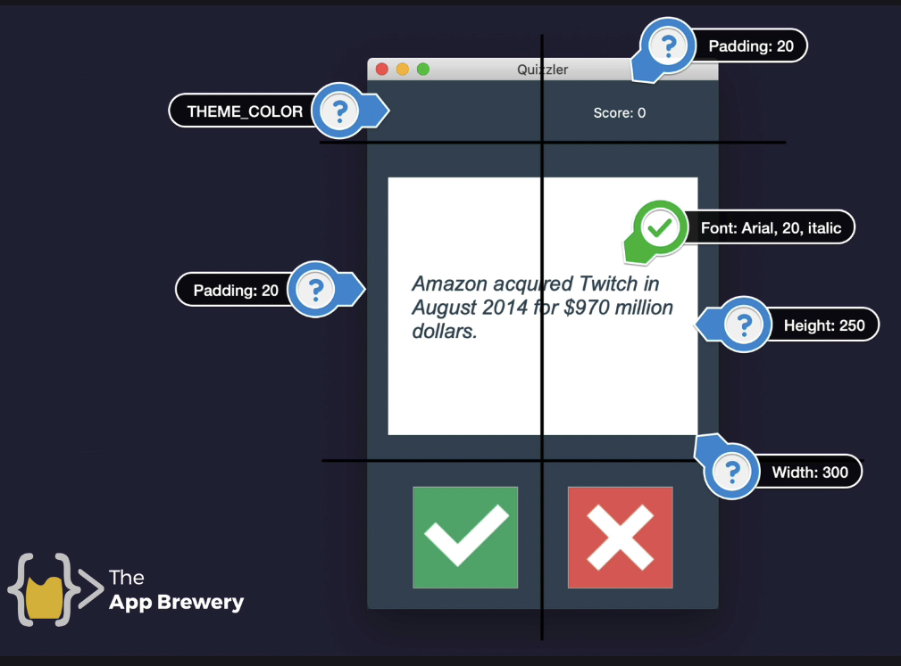

# Quizzler GUI Quiz App - Rudi Lewis
Day 34 Project in the 100 days of Python! 
## Project Description
Upgrade the command line quiz app from Day 17 into a full GUI driven by TKinter,  
and at runtime, supply the user with a random T/F 10 question quiz from the opentdb.com API.

## Deliverables
### MVP: 
- [x] build a working quiz GUI with TKinter
  - [x] use assets from ./assets for true/false images in the GUI
- [x] pull a quiz of 10 T/F questions from the opentdb.com API
  - [x] hint : amount=10 type=boolean

- [x] utilize object oriented programming wherever possible (classes and methods in separate external files, use class inheritance, keep main.py very tight and readable for flow.)
- [x] employ great documentation in any and all *.py files, written so other developers and casuals can easily understand your code blocks and flow

### stretch goals: 
- [x] show the user their real-time stats (1/2 correct (50%))
- [x] let the user go again after the quiz is done (another quiz?)

### super stretch goals:
- [ ] show the user their current stats on each quiz for this run, and cumulative across all quizzes
  - [ ] use pandas for the file read/write/update
- [ ] have the user enter their name, keep current & cumulative stats for each name
- [ ] high scores! personal and global for 1 quiz, and personal (cumulative and rank) vs top 3 global cumulative highs 
- [ ] update with user choice of category or "all" (no category param) before each quiz (categories found in ./assets/opentdb_categories.json)
- [ ] keep additional cumulative stats according to category and difficulty (easy, medium, hard is available data for each question via the api) as well.

## Mockup

## To Run
  1. For now, clone to local deployment only. 
     - Requires:
       - TKinter GUI package (usually included in your standard Python install).
       - html package for unescaping escape characters in the question texts (usually included in your standard Python install)
       - Requests api package available on pypi.org
       - Pandas data analysis toolkit available on pypi.org
  2. I built it in Python 3.14.2, but I think it should work in any 3.x based on the standard libraries and code used.

## Development Workflow
- [x] 1. Get the API working (10 random T/F questions) for a single run of the existing command line version of the quiz
  - [x] 1. modify the data.py (comment out the existing code)
  - [x] 2. make a get() request to fetch 10 T/F questions
  - [x] 3. Parse the JSON response and replace the value of question_data (don't change the variable name)
  - [x] 4. hint: create a Python dictionary for the **amount** and **type** parameters  
- [x] 2. Clean up special characters appearing in the question_data as they are presented, using the python `html` module's `unescape` function within the quiz_brain.py next_question function
- [x] 3. Build the GUI in its own Class **QuizInterface** in ui.py according to the mockup above.
  - [x] 1. use "Some Question Text" as the object's self.question_text placeholder so you can show how a question would look without building that logic yet.
  - [x] 2. use the button images from ./assets
  - [x] 3. import the class into main.py and "run it" by creating the object quiz_ui = QuizInterface()
  - [x] 4. Comment out the main.py while loop so we don't confuse the program, we're just looking to launch the static GUI in this step.
- [x] 4. Build the quiz logic using get_next_question as a function of the ui.py 
  - [x] 1. output the next_question from quiz_brain.py , instead of checking the answer there
  - [x] 2. in ui.py, create a function get_next_question(self) that taps into quiz_brain
  - [x] 3. pass quiz object from main.py into ui.py and in ui.py import QuizBrain from quiz_brain.py, to ensure object oriented control flow
    - [x] 1. in main.py, pass the quiz object into ui.py, and catch it in ui.py by adding a quiz_brain parameter to the QuizInterface Constructor and setting self.quiz = quiz_brain.
    - [x] 1. in ui.py be sure to import QuizBrain from quiz_brain.py and initialize this new parameter as type QuizBrain
    - [x] 2. then in ui.py simply tap into the method in the get_next_question function by setting q_text = self.quiz.next_question()
    - [x] 3. and set the canvas.itemconfig to utilize text=q_text, and config self.question_text to have width 280 to allow wrapping
- [x] 5. Use the true and false buttons as input to check the answer
- [x] 6. Serve up the next question
- [x] 7. Keep score with the ui's score label
- [x] 8. DEPLOY and TEST (locally), report back to me so I can test
- [x] 9. Add stretch goal functionality
- [x] 10. DEPLOY and TEST (locally), report back to me so I can test

## Reflection
| DATE | NOTES |
| --- | --- |
| 20-jan-2026 | am I cheating myself to have AI write the code? I go back and forth on that in my mind. I think the new paradigm for sw dev is: understand the language enough (i.e. work with her through the exercises) to know what modules/classes/functions we want to exploit, understand user needs implicitly, build a requirements and workflow doc, BUT THEN have AI drudge out and initially test the code, then test it yourself and interact with AI with follow-up prompts. **that to me is where the learning and critical knowledge has moved.** |
| 19-jan-2026 | watched Angela's videos, wrote down her main steps into this README.md, added my own stretch and super stretch goals, asked Gemini Code Assist to do the rest. |

## References
  * [Open Trivia Database](https://opentdb.com/)
