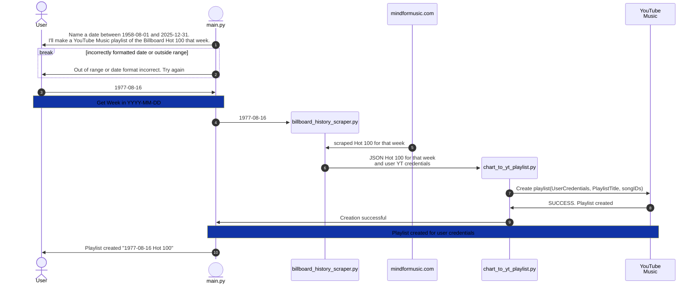

# Musical Time Machine - Rudi Lewis
Day 46 Project in the 100 days of Python! (WARNING: Partially complete)
## Project Description
Use the BeautifulSoup4 package to scrape the Billboard Hot 100 list from a particular date, then use the Requests package and/or the ~~Spotify API~~ __YouTube Music API__ to build a ~~Spotify~~ __YouTube Music__ playlist of those 100 songs.

## Deliverables
### MVP: 
- [x] On local run, prompt the user to enter a date in YYYY-MM-DD format, and you'll supply a Hot 100 playlist from that date
- [x] Pull the "Billboard Hot 100" for the most recent dated tag before that date
  - [x] PIVOT! Billboard.com is now a paywalled site for their Hot 100 data, so we can't scrape from it. 
  - [x] Check viability of scraping the necessary Weekly Hot 100 data from https://www.mindformusic.com/billboard-history (data is in a div viewer, but dev tools shows that viewer contains the data as readable google sheets, one sheet for each year.) 
  - [x] Write the code for the scrape if viable
    - [x] semi-PIVOT! mindformusic is just an iframe viewer to a web-published Google Sheet, "soup" scrapes not conducive, moved to good ol csv pkg method
- [ ] User Authentication and playlist creation into their music app account
  - [x] PIVOT! Spotify developer portal is not allowing new apps at this time 
  - [ ] Check viability of using the Ytmusicapi python module to build the code needed to create the playlist in YouTube Music
- [x] utilize object oriented programming wherever possible (classes and methods in separate external files, use class inheritance, keep main.py very tight and readable for flow.)
- [x] employ great documentation in any and all *.py files, written so other developers and casuals can easily understand your code blocks and flow

### stretch goals: 
- [ ] put the code in a "lite" web app that gives users the prompt, then makes the list ready for YouTube Music and/or Spotify upload, and gives them instructions on how to do it.

<!--
### super stretch goals:

## Mockup
-->

## Sequence Diagram

## To Run
  1. For now, clone to local deployment only. 
     - Requires:
       - Requests api package available on pypi.org
       - BeautifulSoup4 package available on pypi.org
       - Ytmusicapi package available on pypi.org
  2. I built it in Python 3.14.2, but I think it should work in any 3.x based on the standard libraries and code used.

## Development Workflow
- [x] 1. Build the user prompt
- [x] 2. Build the Billboard Hot 100 Week Scraper module
- [ ] 3. Build the Ytmusicapi code using my developer credentials as environmental variables
- [ ] 4. Implement and Test

## Reflection
| DATE | NOTES |
| --- | --- |
| 24-jan-2026 | I learned a lot about scraping, soup, csv, and "scraping public google sheets" in this lesson! Also a lot about Mermaid charts. I produced a working Hot 100 list, but just ran out of time for the YT Music part after Spotify came up empty. Moving on!
| 23-jan-2026 | MUCH better way to do this (if scraping knowledge wasn't the real "test" here) is through mhollingshead/billboard-hot-100 repo which gives weekly Hot 100 in JSON wrapper, updated to current week.
| 22-jan-2026 | running into issues integrating with Spotify (not allowing new developer access), gonna try YouTube music instead. |

## References
  * [Mind for Music - Billboard Hot 100 Chart History](https://www.mindformusic.com/billboard-history)
    * ["Full" History of the Billboard Hot 100 1958-08-01 to 2024-04-27](https://docs.google.com/spreadsheets/d/e/2PACX-1vTWNjuOrkBTQWWevMolvRrBt0IKk_TPXAA-YX8S_6PKjrPAkgS69XoEnfzGysJ-Vbrw_0g9GUiZnc3U/pubhtml?widget=true&headers=false#gid=1455779967) the underlying Google Sheet (each tab is a year, updates stopped in April 2024)
  * [mhollingshead/billboard-hot-100 Github repo](https://github.com/mhollingshead/billboard-hot-100) actually IS the full charts since 1958 to current week, in JSON, updated weekly
  * [YouTube Data API v3](https://developers.google.com/youtube/v3)
  * [Ytmusicapi Github repo](https://github.com/sigma67/ytmusicapi)
    * [pypi.org for supported install of Ytmusicapi](https://pypi.org/project/ytmusicapi/)
    * [Ytmusicapi API Documentation](https://ytmusicapi.readthedocs.io/en/stable/)
  * [Spotify for Developers](https://developer.spotify.com/dashboard)
  * [pypi.org for supported install of Spotipy](https://pypi.org/project/spotipy/)
  