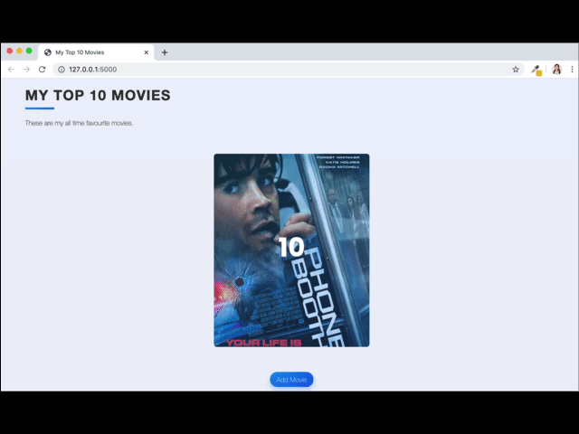
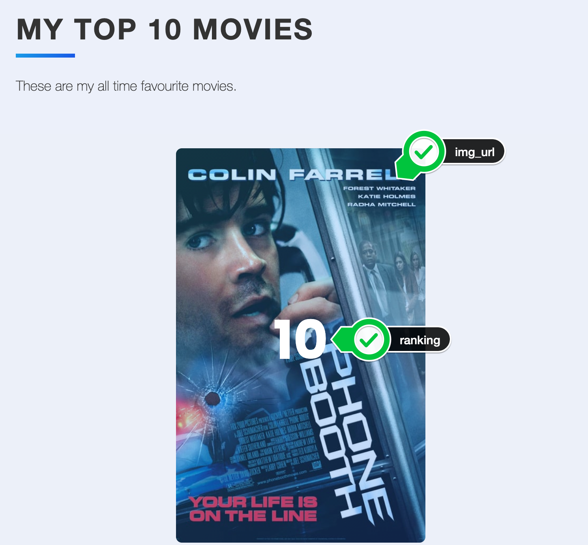
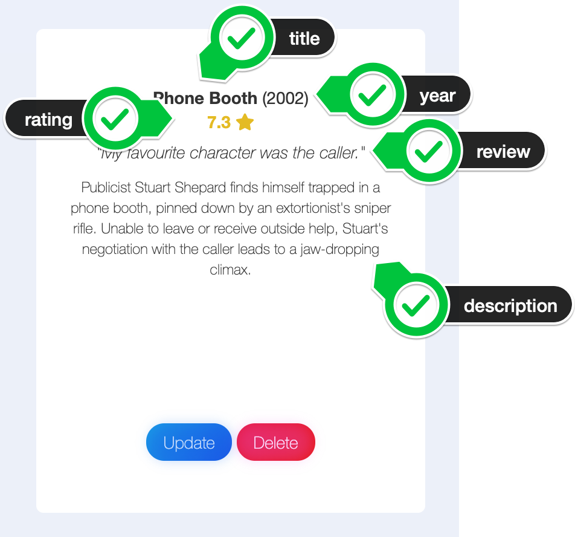
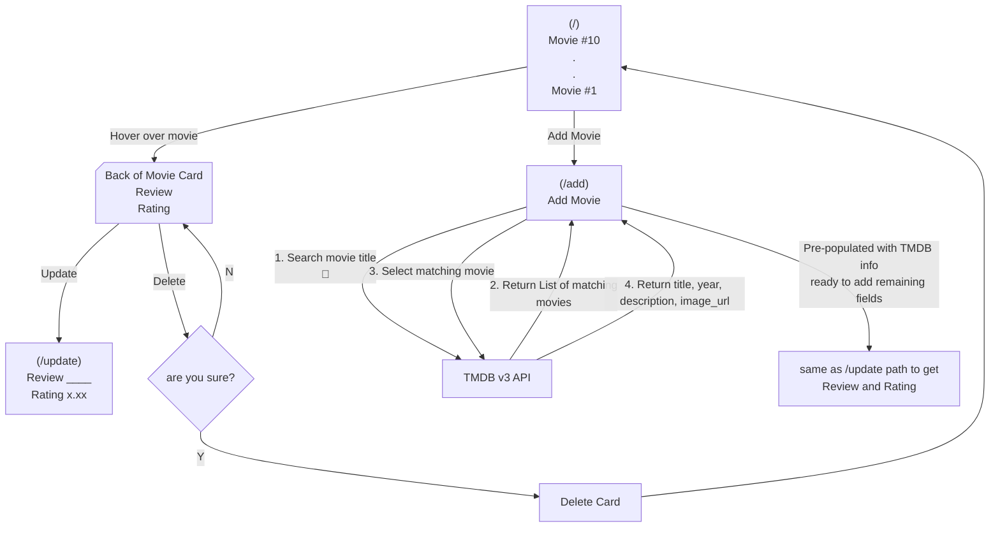
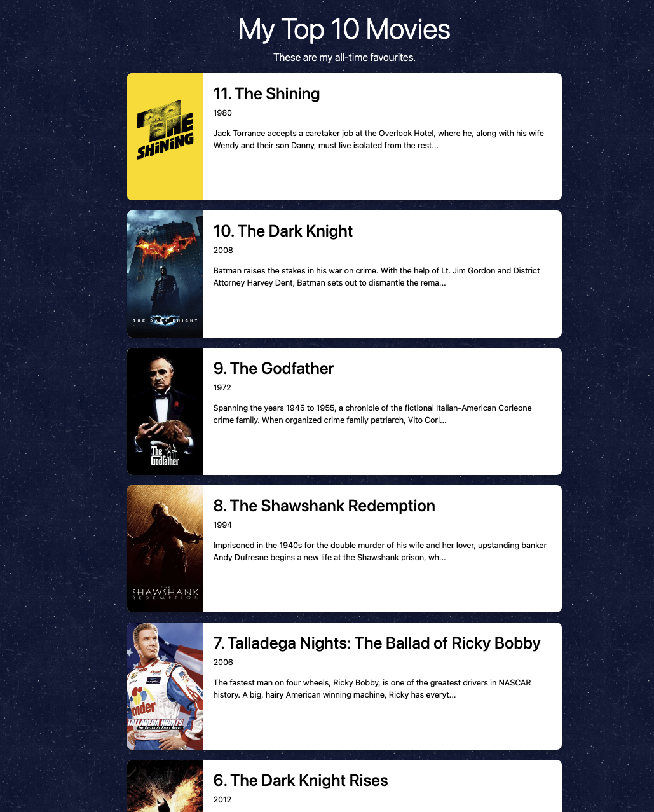
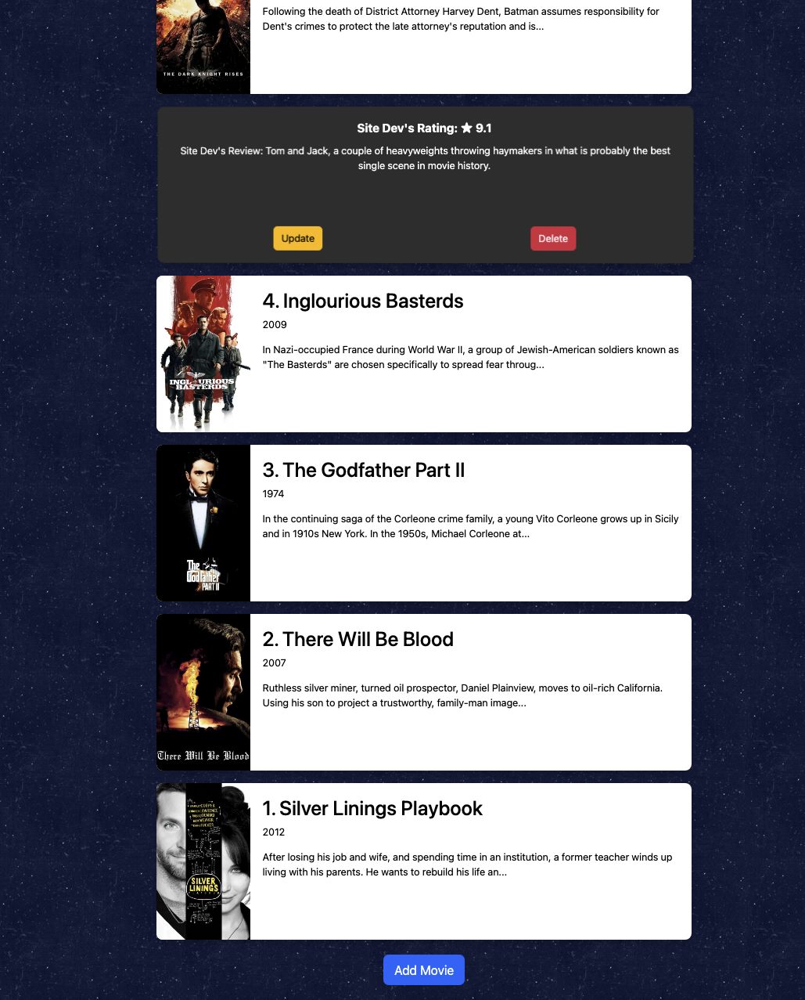
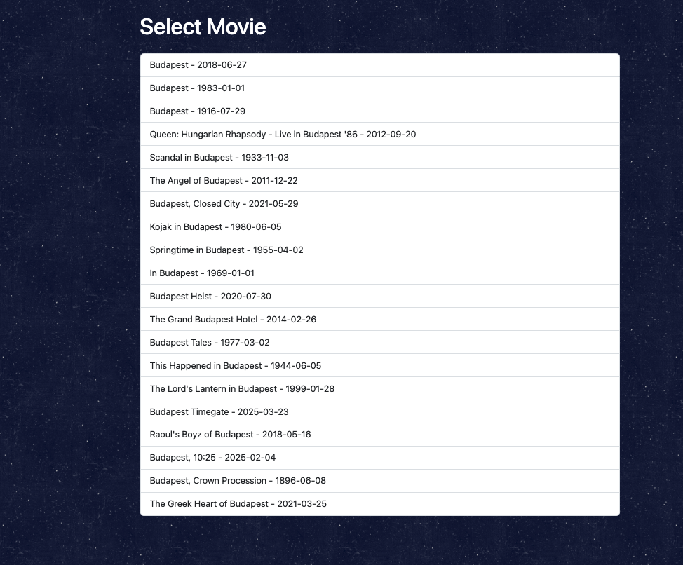

# Top 10 Movies Database - Rudi Lewis
Day 64 Project in the 100 days of Python!
## Project Description
Build a snazzy website displaying my Top 10 Movies. Store the data in a database so I can manipulate the list over time.

## Deliverables
### MVP: 
- [x] code as a website app (local deployment for now) that should allow primary user this __4-step user flow__:
  - [x] 1. View movie list, sorted by ranking on website homepage (`/`) endpoint
    - [x] 1a. sorted from ranking n to 1, vertical card flow (scroll down to get from n to n-1 to 1)
    - [x] 1b. the ranking sort (n..1) is automatic each time, based on the rating field.
      - [x] rating field is 0.00 < x.xx < 10.00, higher x means "lower" (lower is better) n ranking
  - [x] 2. Add movies via "Add Movie" button below movie display
    - [x] 2a. button takes user to an add movie form on `/add` endpoint
    - [x] 2b. user fills in movie title ONLY
    - [x] 2c. program connects to [The Movie Database (TMDB) search-movie API endpoint](https://developer.themoviedb.org/reference/search-movie)
    - [x] 2d. returns list of possible matching movies, let's user select or perform a different search
    - [x] 2e. use the selected movie to retrieve details from [TMDB movie-details API endpoint](https://developer.themoviedb.org/reference/movie-details)
    - [x] 2f. populate relevant details for that movie into our database (title, year, description, image_url)
    - [x] 2g. take the user to the edit endpoint on that movie so they can add rating and review
  - [x] 3. Update movie's rating and/or review via `/edit` endpoint
    - [x] 3a. "hover" mouse cursor on the front of the card to flip to the back of the card
    - [x] 3b. revert to card front whenever cursor is "off" the card
    - [x] 3c. "Update" button on the back of the card (see mockups below)
    - [x] 3d. clicking edit button (OR last step of add card) takes you to a form on `/update` endpoint where you can change the rating and review (only those 2 fields are editable)
  - [x] 4. Delete movies from the database via "Delete" button on the back of the card (see mockups below)
- [x] use Python to build the site in Flask/Jinja2 with SQLAlchemy for the database i/o
- [x] utilize object oriented programming wherever possible (classes and methods in separate external files, use class inheritance, keep main.py very tight and readable for flow.)
- [x] employ great documentation in any and all *.py files, written so other developers and casuals can easily understand your code blocks and flow
  
### Stretch Goals:
- [x] allow for more than 10 movies (however many the user adds)
- [x] user improvements such as acknowledgement of delete, etc.

### Super Stretch Goals:
- [ ] allow update of all fields not just rating and review
- [ ] allow x.xx instead of x.x for rating (this was actually spec'ed in 1.b sub-bullet, but not overtly, so I'm adding it as a future improvement)

## Mockups

 

<!--
  * alternative method for images, html tags are also supported & help you size the image like:
  
  * as you can see, you can make markdown comments using the arrow bang dash dash just like HTML comments
  * Useful for drafting stuff that you want to commit & push for safe draft keeping,
  * but don't want to broadcast via the auto README display in your Github folder.
-->

## Flow Diagram

## To Run
  1. For now, clone to local deployment only. 
     - Install required packages in [requirements_3.13.txt](./requirements_3.13.txt)
  2. I built it in Python 3.14.2, but I think it should work in any 3.x based on the standard libraries and code used.

## Final Product!
  

## Development Workflow
+ [x] 1. Programmatically create an SQLite database using SQLAlchemy. The database needs to contain a "Movie" Table.
  - [x] the Movie fields: **id (unique), title (unique), year, description, rating, ranking, review, image_url**
  - [x] if possible, use a try block or "if not exist" to do the above step, so it only creates the db once and doesn't try on subsequent runs.
- [ ] 2. "Seed" the db by writing code snippets to ingest the data for two movies, found in ./docs/new_movie.txt and ./docs/second_movie.txt
  - [ ] also add safeguards to only add those 2 movies on the first run of the program 
+ [x] 3. make the root / route work by querying the db using flask-sqlalchemy and .scalars() to get the info
  - [x] display the n-to-1 ranked movies correctly (sorted by ranking which is based on rating)
+ [x] 4. wire up the Edit function to be able to edit the rating and review fields, attached to the edit button on the back of the card, and the ./templates/edit.html
+ [x] 5. wire up the Delete function to delete the row from the db (invoked with the delete button on the back of the card)
  - [x] put an "are you sure" acknowledgement in when delete is pressed
  - [x] after delete is acknowledged, take user back to home page and refresh list view
+ [x] 6. wire up the Add endpoint as specified, communicating with the TMDB Version 3 API using the TMDB_API_KEY and TMDB_API_READ_ACCESS_TOKEN (if necessary) in the project's root .env file
  - [x] don't forget to take the user to the /edit of review and rating after adding the fields TMDB gives you
+ [x] 7. Implement and Test

## Reflection
| DATE        | NOTES |
| ----------- | ----- | 
| 30-jan-2026 | Woke up thinking about why Gemini deleted all the pre-built css from Angela and built its own. Answer, it felt more comfortable doing the heady "hover to card-flip" required! [(very bottom of chat.)](/.docs/gemini_chat.md)
| 29-jan-2026 | Why did Gemini not fill in all the development workflow "checks" (see Dev workflow step 2)? [I asked them about it in the final review (scroll to 2nd to last question at bottom of chat)](./docs/gemini_chat.md), along with whether Flow Diagram and Mockups were helpful (they both were!)
| 29-jan-2026 | Did this project 100% from this README.md and a single prompt to Gemini Code Assist in the left pane of vs code. INCLUDING working out the API comms on its own, from the pointer to TMDB api docs. Gemini delivered working code on the first try, then i just had a few follow up prompts for slight improvements to css background and styling improvements. I'll probably work through a couple more this way, then I'm looking to go agentic. | 
| 29-jan-2026 | First mermaid flow diagram experience, not sure that it added a lot to my or Gemini's knowledge (the deliverables already talked through the flow. I'll get Gemini's take on it in the chat.)

## References
  * [The Movie Database](https://www.themoviedb.org/?language=en-US)
  * [TMDB Version 3 API](https://developer.themoviedb.org/reference/getting-started)
  * [Mermaid Flowchart Syntax](https://mermaid.js.org/syntax/flowchart.html)
  * [Gemini Code Assist vs_code extension: left pane chat session for entirety of this project](./docs/gemini_chat.md)
 